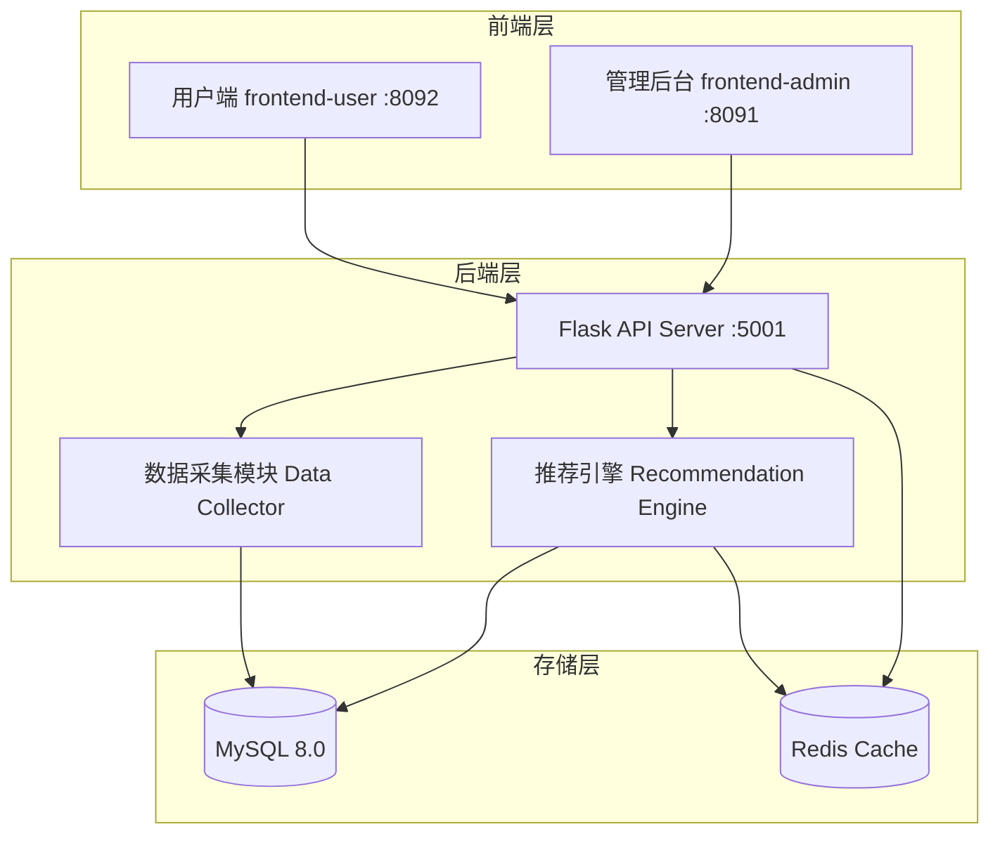
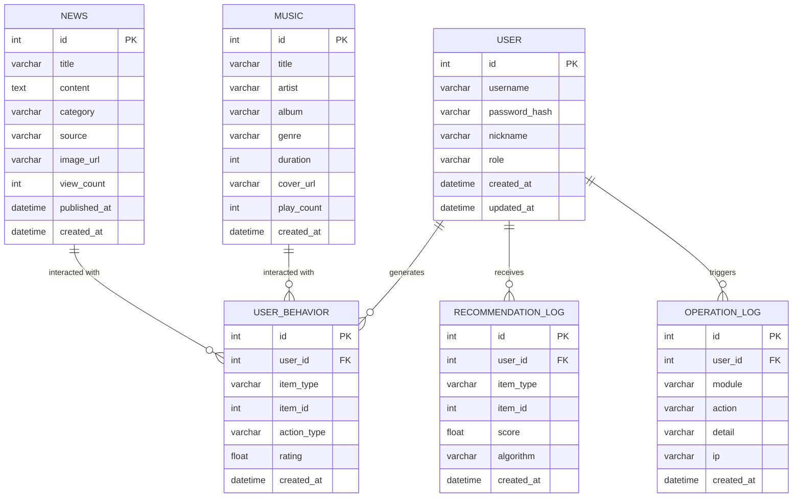

# 内容推荐与兴趣分析系统 - 项目设计文档

## 1. 系统架构

## 2. ER 图

## 3. 接口清单

### AuthController
| Method | Path | Description |
|--------|------|-------------|
| POST | /api/auth/login | 用户登录 |
| POST | /api/auth/register | 用户注册 |
| GET | /api/auth/profile | 获取当前用户信息 |

### UserController (Admin)
| Method | Path | Description |
|--------|------|-------------|
| GET | /api/admin/users | 用户列表 |
| PUT | /api/admin/users/:id | 编辑用户 |
| DELETE | /api/admin/users/:id | 删除用户 |

### NewsController
| Method | Path | Description |
|--------|------|-------------|
| GET | /api/news | 新闻列表 |
| GET | /api/news/:id | 新闻详情 |
| POST | /api/admin/news | 新增新闻 |
| PUT | /api/admin/news/:id | 编辑新闻 |
| DELETE | /api/admin/news/:id | 删除新闻 |

### MusicController
| Method | Path | Description |
|--------|------|-------------|
| GET | /api/music | 音乐列表 |
| GET | /api/music/:id | 音乐详情 |
| POST | /api/admin/music | 新增音乐 |
| PUT | /api/admin/music/:id | 编辑音乐 |
| DELETE | /api/admin/music/:id | 删除音乐 |

### RecommendController
| Method | Path | Description |
|--------|------|-------------|
| GET | /api/recommend/news | 获取新闻推荐 |
| GET | /api/recommend/music | 获取音乐推荐 |
| POST | /api/behavior | 记录用户行为 |

### AnalyticsController
| Method | Path | Description |
|--------|------|-------------|
| GET | /api/admin/analytics/overview | 数据概览 |
| GET | /api/admin/analytics/behavior | 行为分析 |
| GET | /api/admin/analytics/recommendation | 推荐效果分析 |
| GET | /api/admin/analytics/similarity | 用户相似度矩阵 |
| GET | /api/admin/logs | 操作日志 |

### CollectorController (Admin)
| Method | Path | Description |
|--------|------|-------------|
| POST | /api/admin/collect | 手动触发数据采集 |
| GET | /api/admin/collect/status | 获取采集状态 |

## 4. UI/UX 规范

- 主色调: `#1890ff` (蓝色系)
- 辅助色: `#52c41a` (成功), `#faad14` (警告), `#ff4d4f` (错误)
- 背景色: `#f0f2f5`
- 卡片背景: `#ffffff`, 圆角 `8px`, 阴影 `0 2px 8px rgba(0,0,0,0.09)`
- 字体: `-apple-system, BlinkMacSystemFont, 'Segoe UI', Roboto`
- 标题字号: `20px`, 正文: `14px`, 辅助: `12px`
- 间距系统: `8px / 16px / 24px`
